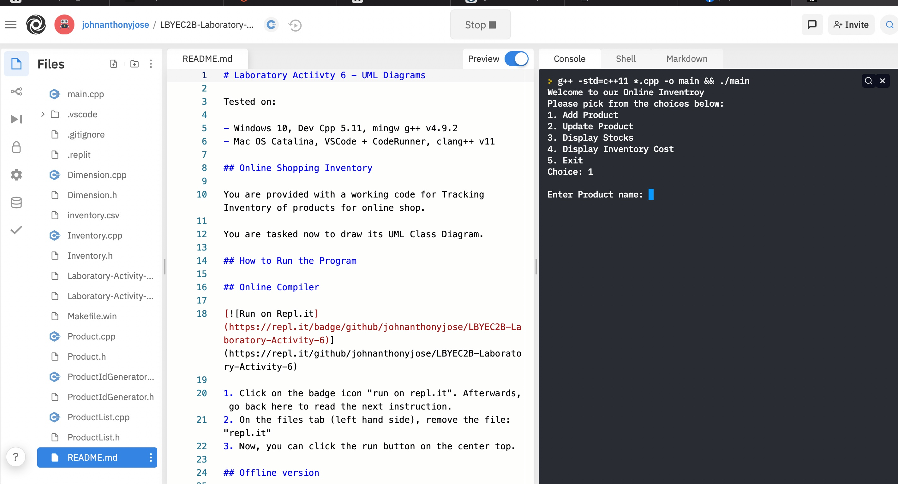

# Laboratory Actiivty 6 - UML Diagrams

Tested on:

- Windows 10, Dev Cpp 5.11, mingw g++ v4.9.2
- Mac OS Catalina, VSCode + CodeRunner, clang++ v11

## Online Shopping Inventory

You are provided with a working code for Tracking Inventory of products for online shop.

You are tasked now to draw its UML Class Diagram.

## How to Run the Program

## Online Compiler

[](https://repl.it/github/johnanthonyjose/LBYEC2B-Laboratory-Activity-6)

1. Click on the badge icon "run on repl.it". 
2. You will be asked to sign-up / login. You'll have to create an account to make it work.
3. On Repl.it IDE, Click on the run button on the center top. 
4. You know it's successful, when the run becomes Stop. And there's already menu prompt as shown on the photo below:


## Offline version

1. Download this repository

   - Click on the "Code" Button, then click "Download Zip"
   - When the download is done, move the "LBYEC2B-Laboratory-Activity-6-master" to your favorite directory.
   - Make sure to remember your favorite directory.

2. On Windows, open your Dev Cpp Project

   - We'll be using Dev Cpp Project rather than just creating a new File.
   - Click on File > Open > Navigate to the said directory on where you save "LBYEC2B-Laboratory-Activity-6-master"
   - Afterwards, click on Project > Add to Project.. > Select All .h and .cpp files inside the directory (make sure to hold shift + left click when selecting each file)
   - When you've already added all files, click on Project > Project Options > Compiler > Code Generation > Language Standard(-std) >> Select ISO C++11
   - You should now be able to compile and run the project

3. On MacOS, open your VSCode with CodeRunner
   - Press File > Open. Navigate to the folder on where you saved "LBYEC2B-Laboratory-Activity-6-master"
   - Afterwards, on the said folder, press open. Make sure that you can see ALL files on the left tab of the vscode.

### VSCode Code Runner Settings

If you are using VSCode with Code Runner plugin, there are some hacks created in this repository to make multiple cpp files work properly. If you follow the instructions above properly, the hacks will be automatically be applied on your PC.

Source: [compile multiple cpp files in vscode](https://stackoverflow.com/questions/59474537/code-runner-configuration-for-running-multiple-cpp-classes-in-vscode)

The code runner workspace settings is replaced from

```javascript
{
"cpp": "cd $dir && g++ -std=c++11 $fileName -o $fileNameWithoutExt && $dir$fileNameWithoutExt"
}
```

to

```javascript
"cpp": "cd $dir && g++ -std=c++11 *.cpp -o $fileNameWithoutExt && $dir$fileNameWithoutExt",
```
